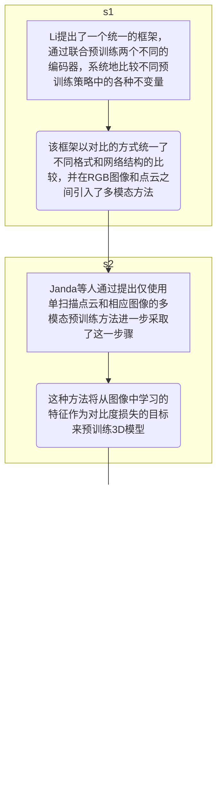

# Self-supervised Learning for Pre-Training 3D Point Clouds A Survey

## 基础知识

### 自监督学习

**自监督学习（self-supervised learning (SSL)）**：是无监督学习里面的一种。自监督学习主要是利用前置任务（pretext）从大规模的无监督数据中挖掘自身的监督信息，通过这种构造的监督信息对网络进行训练，从而可以学习到对下游任务有价值的表征。

​     自监督学习的优势，就是简化了原任务的求解，避免了人工标记样本，可以在无标签的数据上完成训练，而监督学习需要大量的有标签数据，强化学习需要与环境的大量交互尝试，数据为王的时代，此特点也使得大家充分相信自监督学习才是人工智能的发展方向。

​     **注：在自监督学习中，下游任务通常是有标签的数据**

### 迁移学习

**迁移学习：**迁移学习是指将从一个任务、领域或数据集获得的知识和见解转移到另一个任务、领域或数据集的过程

### 特征空间

**特征空间**：特征空间（feature space）是2018年公布的计算机科学技术名词，特征向量所在的空间，每一个特征对应特征空间中的一维坐标

**注意：改变特征在特征空间的分布，在一定程度上会改变特征空间中的特征，但是原始特征并不一定要改变。这主要是因为，特征空间是通过某种映射或变换从原始特征空间得到的。这种映射或变换通常是为了使得特征在新的特征空间中能够更好地表示数据的类别信息。**

### 置信度

在[统计学](https://baike.baidu.com/item/统计学/1175?fromModule=lemma_inlink)中，一个概率样本的**置信区间**（Confidence interval）是对这个样本的某个总体[参数](https://baike.baidu.com/item/参数?fromModule=lemma_inlink)的[区间估计](https://baike.baidu.com/item/区间估计/6611490?fromModule=lemma_inlink)。置信区间展现的是这个参数的真实值有一定[概率](https://baike.baidu.com/item/概率/828845?fromModule=lemma_inlink)落在测量结果的周围的程度。置信区间给出的是被测量参数测量值的可信程度范围，即前面所要求的“一定概率”。这个概率被称为**置信水平**。 具体解释看[知乎](https://baijiahao.baidu.com/s?id=1596169784713150436&wfr=spider&for=pc)

### 相似度

相似度可以用很多不同的方法来计算，以下是一些常见的方法：

1. 余弦相似度：余弦相似度是通过测量两个向量的夹角来计算它们的相似性。两个向量的余弦相似度可以用它们的点积除以它们的模长乘积得到。
2. 欧氏距离：欧氏距离是计算两个向量之间的直线距离，两个向量的欧氏距离可以用它们的模长之差的平方和的平方根得到。
3. 皮尔逊相关系数：皮尔逊相关系数是一种计算两个向量之间相关性的方法，它的值介于-1和1之间，其中1表示完全正相关，-1表示完全负相关，0表示没有相关性。
4. 杰卡德相似系数：杰卡德相似系数是计算两个集合之间的相似性的方法，它的值介于0和1之间，其中1表示两个集合完全相同，0表示两个集合没有交集。

在具体应用中，可以根据不同的数据类型和应用场景选择合适的相似度计算方法。

余弦相似度：余弦相似度计算的是两个向量的夹角的余弦值，并以此来表示两个向量的相似度。

余弦相似度的计算公式如下：

相似度 = 向量A · 向量B / (向量A的模长 * 向量B的模长)

其中，向量A和向量B分别表示要比较相似度的两个向量，向量A · 向量B表示向量的点乘，向量A的模长和向量B的模长分别表示向量A和向量B的长度。

### 长距离依赖关系

​     长距离依赖（Long-range Dependency）指**在序列或图片中，两个远距离的元素之间存在的依赖关系**。在处理长距离依赖时，需要考虑更远处的元素之间的关系，而不仅仅是附近的元素。例如在语言模型中，一个词的意思可能依赖于距离它很远的词，这就需要模型能够捕捉到这种长距离的依赖关系。在图像领域中，长距离依赖可以用来处理整个图片中不同部分之间的关系，例如在图像翻译、分割等任务中，需要考虑图片中不同部分之间的语义关系。

​       在Transformer模型中，长依赖关系通常指的是**需要为长距离依赖关系执行大量操作的问题**。这是由于Transformer模型在处理长序列时，需要计算每个位置的上下文信息，以便在解码阶段能够生成正确的输出。

### 对比学习

**什么是对比学习？**

​        论文中解释：对比学习是一种流行的自监督学习方法，它涉及通过辅助任务构建正样本和负样本，并训练模型使正样本对在嵌入空间中更接近，同时将正样本与负样本分离，与生成方法相反，对比学习不依赖于特定样本的细节，而是在嵌入空间中区分正样本和负样本。此功能使模型更容易优化和更普遍化。

​       csdn解释：对比学习是一种自监督学习方法，用于在没有标签的情况下，**通过让模型学习哪些数据点相似或不同来学习数据集的一般特征**。

​      其他解释：对比学习是一种机器学习范例，其中将未标记的数据点相互并列，以教导模型哪些点相似，哪些点不同。也就是说，顾名思义，样本相互对比，属于同一分布的样本在嵌入空间中被推向彼此。相比之下，属于不同分布的那些则相互拉扯。

### 深度神经网络，ANN与多层感知机MLP

**深度神经网络（DNN）**：是一种多层无监督神经网络，并且将上一层的输出特征作为下一层的输入进行特征学习，通过逐层特征映射后，将现有空间样本的特征映射到另一个特征空间，以此来学习对现有输入具有更好的特征表达。深度神经网络具有多个非线性映射的特征变换，可以对高度复杂的函数进行拟合

深度神经网络与传统神经网络的主要**区别**在于训练机制。为了克服传统神经网络容易过拟合及训练速度慢等不足，深度神经网络整体上采用**逐层预训练**的训练机制，而不是采用传统神经网络的**反向传播**训练机制。

**ANN**：Artificial neural network前馈神经网络的缩写

**ANN与DNN的结构**：当神经网络只有一个隐藏层时，成为 ANN；当神经网络的隐藏层为两个或两个以上时，称为 DNN。

**多层感知器MLP，全连接网络，DNN三者的关系：**

​      全连接神经网络（Fully Connected Neural Network, FCN），也称为密集连接神经网络，其每个节点都与上一层的所有节点相连，也就是说每个神经元都和上一层所有的神经元都有连接，是最简单的神经网络结构，它不一定要求有隐藏层。

​     多层感知机（Multi-Layer Perceptron, MLP）是一种特殊的全连接神经网络，它由输入层、若干个隐藏层和输出层组成。每个神经元都与上一层的所有神经元相连。

​     因此，MLP和FCN之间的主要区别在于隐藏层的存在。MLP通过添加多个隐藏层可以提高网络的表示能力，从而能够更好地解决复杂的分类和回归问题，而FCN有时候可能只有输入层和输出层。

​    深度神经网络（Deep Neural Network, DNN）是指具有多层神经元的神经网络。因此MLP属于DNN；FCN有时候属于DNN，有时候不属于DNN。但DNN也包括许多其他的深度网络，比如深度卷积网络等。

### 知识蒸馏

​    **知识蒸馏：是一种模型压缩方法，通过构建一个轻量化的小模型，利用性能更好的大模型的监督信息，来训练这个小模型，以期达到更好的性能和精度**。

知识蒸馏最早由Hinton在2015年首次提出并应用在分类任务上面，这个大模型称之为teacher（教师模型），小模型称之为Student（学生模型）。

**知识蒸馏的原理**：是让student学习到teacher的泛化能力，而不是"过拟合训练数据"。

例如：

​         有这样一个问题：给定一张图片，让模型判断图片中的物体是猫、狗还是猪。对于这个问题，我们可以构建一个复杂的模型，例如一个深度神经网络，让这个模型学习到如何判断图片中的物体类别。这个复杂的模型就是教师模型。

​		然后，我们再构建一个简单的模型，例如一个线性分类器，让这个模型学习到如何判断图片中的物体类别。这个简单的模型就是学生模型。最后，我们将教师模型的知识（也就是它的判断能力）传递给学生模型，这样学生模型就可以获得和教师模型类似的判断能力，但计算复杂度却大大降低了。这就是知识蒸馏的过程。

### 点云基础

**点云物体和室内场景级，室外场景级是什么意思？**

点云物体和室内场景级，即物体与室内场景所形成的的点云，室外场景级即室外场景所形成的点云

**exp**:exp，[高等数学](https://baike.baidu.com/item/高等数学/1182?fromModule=lemma_inlink)里以[自然常数](https://baike.baidu.com/item/自然常数/1298918?fromModule=lemma_inlink)e为底的[指数函数](https://baike.baidu.com/item/指数函数/6013301?fromModule=lemma_inlink)

**pretext tasks（前置任务）**：即为达到特定训练任务而设计的间接任务，而在网络训练中pretext task即产生不涉及人工的伪标签，对网络结果进行与训练 

​    例如设置一个前置任务，给定灰度图情况下来预测图像的彩色版本。或者可以删除图像的一部分，并训练一个模型从周围预测该部分

如下图：

**ground truth（基准真相）**：基准真相是一个相对概念；
它是指相对于新的测量方式得到的测量值，作为基准的，由已有的、可靠的测量方式得到的测量值（即经验证据）。人们往往会利用基准真相，对新的测量方式进行校准，以降低新测量方式的误差和提高新测量方式的准确性。

机器学习领域借用了这一概念。使用训练所得模型对样本进行推理的过程，可以当做是一种广义上的测量行为。因此，在有监督学习中，ground truth 通常指代样本集中的标签。

**3D点云自监督学习的过程：**

​      3D点云的自我监督预训练的管道从未标记的点云开始，然后使用自我监督学习的前置任务对深度神经网络进行预训练。学习到的点云表示随后在各种下游任务中使用以初始化网络。最后，预训练的网络使用少量标记的特定任务点云数据进行微调，以实现高性能。过程图如下：

**最近和最相关的基于SSL的点云预训练方法的分类如下：**

### 评价指标

​    **OA（总体准确度）**：OA计算所有测试实例的平均精度，测量正确分类的形状占测试数据集中形状总数的比例，对于在不考虑类不平衡的情况下确定模型跨所有实例的一般性能，它非常有用。

具体如何计算可看 

> https://blog.csdn.net/aiwoshan0908/article/details/79159187

**mAcc(平均分类准确度)**:mAcc是所有形状类别的平均精度，它考虑了类别不平衡，从而提供了对各种形状类别分类的模型性能的更全面评估

具体可看

> https://www.yii666.com/blog/420139.html

**AP(平均精度)：**平均精度（AP）是3D对象检测中的标准评价度量。它被计算为精度-召回曲线下的面积。

具体看见

> https://zhuanlan.zhihu.com/p/88896868

**IOU（交并比）：**交并比IoU衡量的是两个区域的重叠程度，是两个区域重叠部分面积占二者总面积（重叠部分只计算一次）的比例。

如下图，两个矩形框的IoU是交叉面积（中间图片红色部分）与合并面积（右图红色部分）面积之比。

**mIOU（平均交并比）:**mIOU就是该数据集中的每一个类的交并比的平均,是语义分割的标准度量，几乎所有分割相关论文都会使用。在语义分割的问题中，单类的交并比就是该类的真实标签和预测值的交和并的比值。示意图如下：

在图中，A为真实标签，B为预测结果。中间的TP部分就是真实标签和预测值的交集，图像整个有颜色的部分就是真实标签和预测值的并集。而mIOU就是该数据集中的每一个类的交并比的平均。计算公式如下：

$p_ij$表示将$i$类别预测为$j$类别,其中$k$为总类别个数

也可以写作：

其中P表示预测值，G表示真实值，K表示总类别个数。总体拉看，公式表示每个类别的预测值和真实值的交集除以并集，然后取平均。

> 倒角距离（CD）和推土机距离（EMD）是3D重建中最常用的标准。

**CD（倒角距离）：**CD计算一个集合中的每个点与另一个集合中的每个点之间的最小距离

**EMD(推土机距离)**：EMD测量将一个点云分布转换为另一个点云分布的最小成本。

## 对象和室内场景级SSL（OBJECT AND INDOOR SCENE-LEVEL SSL）（SSL即自监督学习）

- 对象级SSL方法主要集中在使用单独的3D对象（例如椅子、桌子、汽车等）来预训练模型，这些3D对象通常与语义标签相关联以提供关于其身份的上下文信息。这种类型的数据通常用于对象识别、检测和分割等任务，旨在识别和定位较大场景中的单个对象。
- 室内场景级SSL方法专注于使用整个3D室内环境的预训练模型，通常包含多个对象及其空间布置。室内场景级数据通常与对象和建筑元素的语义标签相关联，如“墙”、“门”、“窗”和“地板”，或按功能标签分类，如“厨房”、“卧室”、“客厅”或“办公室”。与对象级SSL方法相比，室内场景级SSL方法通常需要将输入数据预分割成语义区域或对象以提供关于场景的上下文信息。

### 基于重构的SSL（Reconstruction-based SSL）：

​       基于重建的自监督学习方法采用重建任务来使网络能够学习更好的3D点云表示。基于重构的SSL采用编解码器结构，编码器学习通过潜在代码向量表示点云对象，而解码器从潜在代码重构输出对象，输入点云可以被掩蔽或损坏，导致两个主要的方法组。过程如下图所示

基于重构的SSL根据借口任务的性质，它们可以大致分为两个主要的亚组：基于模掩和腐蚀。还有一些方法不适合这两组，它们被归类为“其他”方法。

- **基于掩码的方法（Mask-based Methods）**：基于掩码的自监督学习方法涉及使用掩模通过随机采样不同的相机视点并掩蔽每个视点中的所有遮挡点来生成掩蔽点云数据集。

  - **self-supervised pre-training method OcCo（自监督模型OcCo）**

  ​      

  ​       如图所示:点云预训练的简单方法：1.取任何点云数据集，并通过以下方式为每个输入生成遮挡点云：（a）随机采样相机视点，     以及（b）移除从该视点隐藏的任何点（对于所有实验，我们使用从ModelNet 40生成的相同遮挡数据集）; 2.训练编码器-解码器模型  以*完成被遮挡的点云*（即让被遮挡的点云完整）（编码器可以是学习点云的表示的任何模型，解码器可以是任何完成模型）; 3.使用学习的编码器权重作为任何点云任务的初始化（例如，少量学习、对象分类、部分分割、语义分割）。这种方法在多个模型和任务中的  性能优于各种预训练方 法。

  基于掩码的各种方法统计表

  |          方法          | 方法及其优点                                                 | 缺点                                                         | 为解决的问题                                                 |
  | :--------------------: | ------------------------------------------------------------ | ------------------------------------------------------------ | ------------------------------------------------------------ |
  |        MaskSurf        | 一种自监督的预训练方法，它采用简化的面元表示（即，位置和方向）来增强点云表示，并利用倒角距离（CD）和位置索引法向距离（PIND）作为位置和方向的重建损失来以集合到集合的方式预测掩蔽的面元。明确考虑了点云的局部几何信息 | ---                                                          |                                                              |
  |       Point-BERT       | 在预训练之前，Point-BERT将输入点云划分为多个局部块，并使用dVAE标记器为每个块生成离散点标记。在预训练过程中，该方法使用一个Transformer来预测随机掩码块的掩码输入，并将其预测结果与预测目标的离散点令牌进行比较，以捕获高级语义知识并学习不同块之间的几何关系。被掩蔽的令牌被馈送到包含其位置信息的编码器中，从而降低了重建任务的难度。1 | 1.dVAE标记器侧重于点云的几何结构，忽略了相似局部点片之间的关系。2由于需要预训练dVAE的准备，整个预训练过程是相对复杂和耗时的，并且严重依赖于数据增强和对比学习。而且Point-BERT通过为每个面片分配唯一的令牌ID来对点云中的局部点面片进行编码。然而，当不同的本地补丁具有相似或相同的功能时，它们可能被分配相同的令牌ID，从而导致信息丢失和性能下降。 |                                                              |
  |        McP-BERT        | 其基于概率分布向量为每个局部点片使用改进的多选令牌。该方法避免了由于严格的单选约束而导致的语义不同的补丁具有相同的令牌ID的问题。此外，概率分布向量通过合并由Transformer学习的高级语义关系来进一步细化，这有效地克服了由于噪声干扰而具有不同令牌ID的语义相似补丁的问题。 | ---                                                          | Point-BERT通过为每个面片分配唯一的令牌ID来对点云中的局部点面片进行编码。然而，当不同的本地补丁具有相似或相同的功能时，它们可能被分配相同的令牌ID，从而导致信息丢失和性能下降。为了解决这个令牌模糊性问题， |
  |        POS-BERT        | 这是一种单阶段的预训练方法。用动态更新的动量编码器取代Point-BERT中使用的weightfrozen标记器，POS-BERT在网络训练期间实现自适应变化。通过使用单阶段预训练方法，POS-BERT消除了对额外微调步骤的需要，降低了总体训练成本。此外，POS-BERT引入了对全局点云和局部点云不同裁剪比例获得的类令牌的对比学习，最大化点云对之间的类令牌一致性，从而更好地学习高级语义表示。 | ---                                                          | Point-BERT模型具有复杂的训练步骤，可能耗时且难以优化         |
  | ContrastMPCT and MAE3D | ContrastMPCT采用了基于对比学习和掩蔽自动编码器的自监督策略。它使用倒角距离测量预测点云和地面实况点云之间的相似性，并基于JSD和InfoNCE设计两个联合损失函数，以最大化输入和输出令牌之间的全局依赖性，以加快模型收敛。MAE3D直接利用transformer学习局部面片的几何特征和它们之间的上下文关系。它还设计了一个多任务重建损失，同时考虑了预测的局部块的中心点和点云重建的折叠操作。 | ---                                                          | ContrastMPCT和MAE 3D 是通过消除额外的标记器训练阶段来降低Point-BERT复杂性的替代方法。 |
  |       Point-MAE        | 该方法降低了模型的复杂度，并修复了Point-BERT的位置信息泄漏。该方法由三个主要部分组成：点云掩蔽模块、嵌入模块和自动编码器模块。点云掩蔽模块随机掩蔽分割后的点云，以减少由于点云分布不均匀造成的数据冗余。自动编码器模块使用完全由标准变压器构造的非对称编码器-解码器结构，除了变压器之外不引入其他网络。与Point-BERT不同，该方法选择轻量级解码器来处理掩码令牌，而不是编码器。将掩码令牌移位到解码器的输入的操作不仅允许编码器更好地学习点云的高级语义特征，而且还通过降低模型的复杂性和避免泄漏掩码令牌的早期位置信息来提高预训练效率。 | 尽管它的简单和高效率，Point-MAE只能应用于单一分辨率的点云，没有考虑其局部结构和全局形状之间的关系。 | 受2D计算机视觉中掩模自动编码（MAE）的成功启发                |
  |       Point-M2AE       | 使用一个类似于UNet的Transformer架构，具有多尺度层次结构，以逐步编码和重建点云。这允许网络学习3D形状的多尺度几何结构和细粒度信息。在对点令牌进行下采样之前，PointM2AE采用了多尺度掩蔽策略，通过跨尺度生成一致的可见区域，使网络能够连贯地学习特征并避免信息泄漏。 |                                                              | 尽管Point-MAE的简单和高效率，但只能应用于单一分辨率的点云，没有考虑其局部结构和全局形状之间的关系。 |
  
  
  
  
  
  
  
  
  
  **细粒度信息？**
  
- **基于腐蚀的方法（Corruption-based Methods）：** 采用基于破坏的辅助任务，其中点云被故意破坏，然后恢复，以预训练模型

  - CP-Net：	其利用权重共享双分支结构来有效地引导点云表示的结构轮廓和语义内容的自监督学习。双分支结构的辅助分支增加了轮廓扰动增强模块，通过扰动点云轮廓同时保留其内容，迫使其专注于区分下游任务的语义内容。另一个分支从辅助分支学习被忽略的高层语义内容信息，通过引入双分支一致性损失来提高点云表示的鉴别能力。

  ​       其自训练模型如下图

  ​       

  其中轮廓扰动增强模块为：

  

  形状自校正[32]采用形状分解策略来破坏物体的某些局部形状部分。然后将损坏的形状和原始形状馈送到点云网络中以获得表示，用于分割属于扭曲部分的点并恢复它们以恢复形状。

  **基于腐蚀的各种方法表**

  | 名称      | 方法                                                         | 研究结果                                                     |
  | --------- | ------------------------------------------------------------ | ------------------------------------------------------------ |
  | Point-DAE | 一个通用的去噪自动编码器，这是在14种类型的腐败作为借口任务下探索，包括密度，噪声，和仿射变换。 | 他们的研究结果表明，任务依赖性和性能之间存在线性关系，Point-DAE在仿射变换任务下表现最好，这与分类任务更相关。他们还引入了一个新的数据集设置，允许自动估计规范姿态，从而消除了预训练数据集中同一类别的手动对齐规范姿态带来的隐式类别标签。 |
  | SeRP      | 它采用点云扰动作为借口任务。                                 | 该方法涉及从1024个点的输入点云中随机选择20个点，并使用最近的邻居为每个选定的点形成补丁，然后应用高斯噪声来校正每个补丁。SeRP采用基于PointNet [35]和Transformers的自动编码器来重建原始点云。此外，构建了一个自动编码器来实现离散表示的矢量量化，扩展了SeRP-Transformer。 |

  

- **其他方法（Other Methods）**

   本小节讨论了不属于基于重构或基于损坏的方法的几种方法。

各种方法如下表

| 名称                                                         | 方法/结构                                                    | 优缺点                                                       |
| ------------------------------------------------------------ | ------------------------------------------------------------ | ------------------------------------------------------------ |
| The 3D jigsaw-based self-supervised learning method（基于3D拼图的自监督学习方法） | 包括沿着坐标轴将输入点云均匀地划分为k3个体素，并根据相应的体素ID标记每个点。体素以随机顺序重新排列，然后训练网络以预测每个点的正确标签分配。 | 优点：这种方法不仅提高了自动编码器的重建能力，而且具有应用于几乎任何使用原始点云预训练的深度学习模型的灵活性。 缺点：它可能无法处理各种下游任务和处理大规模点云。此外，随机排列的合成点云和真实生成的点云之间存在差异，这可能导致下游任务的初始化预训练权重较差。 |
| DefRec                                                       | 研究SSL在点云上的域适应时引入的一个自监督任务。 其包括三种类型的区域选择方法。该任务涉及用高斯分布采样的新点替换区域点以实现变形，然后训练共享特征编码器以重构变形的输入样本。为了在源域上训练标记样本，DefRec采用点云混合（PCM）结合MixUp方法来取代标准的交叉熵分类损失，从而提高目标域上的分类性能。 | 优点：提高了目标域上的分类性能。                             |
| multi-stage training method                                  | 一种多阶段训练方法，用于学习跨不同对象类别的统一重建模型，从而能够从数百个类别的单个视图重建3D对象。 在训练的第一阶段，它使用合成数据的多视图渲染来预训练基本重建模型，帮助模型以弱监督的方式学习正确的3D先验。在训练的第二阶段，该方法自训练类别特定的模型，从各种单视图图像集，只有前景掩模注释，通过微调初始模型获得不同的类别集。最后，将前一训练阶段各类别的自适应模型提取到统一的重构网络中，得到具有更好泛化能力的联合模型。 | 优点：这种方法在重建物体的全局结构方面是有效的 缺点：它在捕获这些物体的精细几何细节方面具有局限性。 |
| an SSL method that is adaptable for any DNN architecture producing point-wise classification scores | 适用于任何DNN体系结构的SSL方法，产生逐点分类分数 该方法将3D点软分割成一组离散数量的几何分区，并隐式地参数化这些软分区中的潜在高斯模型，通过最大化与无监督逐点分割网络生成的软分区相关联的数据似然性，该方法促进了几何信息丰富的学习表示。 | 优点：该方法促进了几何信息丰富的学习表示                     |
| UAE（up-sampling auto-encoder）                              | 种上采样自动编码器（UAE），它不需要处理或检索负样本，也不依赖于任何数据增强技术。UAE将低比例的子采样点作为解码器的输入，并且直接从点空间重构上采样点，从而提供捕获高级语义信息的简单且有效的上采样模型。 | 优点：提供捕获高级语义信息的简单且有效的上采样模型。         |
| implicit auto-encoder (IAE)                                  | 隐式自动编码器（IAE），它使用隐式函数作为输出表面表示。      | 优点：与点云自动编码器相比，IAE有效地解决了采样变化问题，并提供了一个紧凑和计算效率高的解决方案，具有处理大规模真实世界点云的潜力。 |

### 基于对比学习的SSL（Contrastive-learning-based SSL）

- **基于视图的方法（View-based Methods）**：以PointContrast为例，旨在对具有不同视图的两个转换点云执行点级别比较，以捕获点级别的密集信息。

  - PointContrast: Pretext task for 3D pre-training.

    

    其流程为：

    1. 从x生成两个视图$x_1$和$x_2$。
    2. 计算$x_1$和$x_2$中的点之间的对应映射（匹配）M（即找到相互匹配的点，举个例子，从**正面**和**侧面**照向桌子，将两次扫描中空间中的**相同点**给找出来）
    3. 对两个变换T1和T2进行采样
    4. 计算变换后的每个点的特征f1、f2
    5. 利用Contrastive loss进行损失计算
    
    基于视图的方法统计表
    
    | 名称                                        | 方法                                                         | 优缺点                                                       | 为解决的问题                                     |
    | ------------------------------------------- | ------------------------------------------------------------ | ------------------------------------------------------------ | ------------------------------------------------ |
    | PointContrast                               | 是一种用于多视点三维点云理解的点级自监督对比学习方法，PointContrast旨在在具有不同视图的两个转换点云中执行点级比较，以捕获点级的密集信息。有两个损失函数设计用于对比学习。一个是最难对比损失，这是从FGCF借用[52]。这种损失的一般思想是直接最小化匹配点特征之间的距离，并最大化非匹配点之间的距离。另一个是PointInfoNCE损失，它源自InfoNCE损失，但侧重于对点级信息进行建模。实验结果表明，这种损失比最硬对比损失更容易优化，更稳定 | 优点：PointContrast在各种具有上下文的3D点云理解任务中展示了自监督预训练的有效性 缺点：1.该方法不利用空间上下文信息，如方向，距离和相对位置，这是在许多理解任务的关键。2.PointContrast的可扩展性受到其仅使用1024个点进行预训练的限制，这意味着提供更多点并不能提高性能。3.PointContrast需要资源密集型输入，例如相机的绝对位置，这些输入不容易获得。这些问题突出需要进一步的研究，以提高PointContrast的可扩展性，效率和有效性。 | 用于多视角3D点云理解的点级自监督对比学习方法     |
    | DepthContrast                               | DepthContrast分别在体素和点级别采用两个特征提取器，从两个增强输入中提取四个特征，并以成对方式计算它们之间的InfoNCE损失，然后聚合结果 | 优点：DepthConstrast已经证明了将基于体素的表示和基于点的表示相结合以提高3D点云理解的潜力。 | 为了减少PointContrast的资源密集型问题            |
    | Contrastive Scene Contexts                  | 对比场景上下文利用场景中的点级对应和空间上下文。该方法根据点之间的相对距离和角度将空间划分为非均匀单元，并在每个空间单元中分别进行对比学习。它通过在空间单元中采样负样本来引入空间信息。 | 已被证明优于PointContrast在S3DIS和ScanNet数据集的语义分割和检测任务 | 为了解决3D场景理解中的数据效率问题               |
    | unified contrastive learning framework      | 该框架利用了3D特征的不变性，例如同一场景视图之间的透视不变性，RGB和深度图像之间的模态不变性，以及点云和体素之间的格式不变性。此外，还介绍了一种简单有效的方法，用于联合预训练3D编码器和深度图编码器。 | 缺点：一起预训练两个编码器并不一定保证每个单独编码器的最佳性能。 | 为了在预训练中系统而公平地比较不同的不变量       |
    | multi level self-supervised learning method | 目的是学习在不同的采样模式和密度的点云的内在特征，它通过最大化不同下采样结果之间的互信息并最小化下采样和上采样的结果与原始点云之间的倒角距离来学习在几何采样上不变的函数 | ---                                                          | 目的是学习在不同的采样模式和密度的点云的内在特征 |
    
    

- **基于Transformer的方法（Transformer-based Methods）**：以MPCT为例，它随机屏蔽输入点并使用Transformer的能力恢复它们。Transformer的主要优点之一是它们能够使用自注意机制捕获数据序列中的==长程依赖关系==，Transformer体系结构可以在不需要任何显式位置编码的情况下对无序点进行操作，并且通过利用自注意机制来有效地捕获元素之间的长程依赖性。

  基于transformer的方法统计表

  | 名称         | 方法                                                         | 优缺点                                                       | 解决的问题                                                   |
  | ------------ | ------------------------------------------------------------ | ------------------------------------------------------------ | ------------------------------------------------------------ |
  | ContrastMPCT | ContrastMPCT 是一种基于对比学习的自监督预训练框架，它计算MPCT重建的点云与原始点云之间的对比度损失。ContrastMPCT采用两种对比度损失函数：基于Jensen-Shannon散度（JSD）的损失和InfoNCE损失。 | 优点：与Point-BERT相比ContrastMPCT的对比学习设计使得不需要预先训练“分词器”，并且更容易训练。 | MPCT（Mask point cloud transformer）是一种常用的方法，它随机屏蔽输入点并使用Transformer的能力恢复它们，ContrastMPCT则是为了优化MPCT的重建性能 |
  | POS-BERT     | 一种基于Transformer的模型，它在Point-BERT的基础上，引入了对通过不同裁剪比率获得的全局和局部点云之间的类令牌的对比学习，POS-BERT中的对比学习方法最大化点云对之间的类标记一致性，从而有效地学习高级语义表示。 | 优点：有效地学习高级语义表示                                 |                                                              |

  

- **基于SimSiam的方法（SimSiam方法）：** 基于SimSiam的方法为3D点云对比学习中常用的基于InfoNCE的损失函数，提供了一种替代方案。SimSiam体系结构[59]在训练期间只需要正样本对，在基于SimSiam的方法中，利用具有共享权重的两个或更多个Siamese神经网络来分别编码相同输入的不同增强版本。这些编码用于最小化对比学习的负余弦相似性，此外，预测模块被添加到其中一个分支，并且采用具有停止梯度的非对称设计来防止训练崩溃，通过利用正样本对和共享权重，基于SimSiam的方法减少了训练所需的数据量，并提高了3D点云理解任务的整体性能。

  - SimSiam即Simple Siamese，简单的孪生网络。简单的孪生网络即使不使用以下任何一种也可以学习有意义的表示：(i)负样本对，(ii)大批量，(iii)动量编码器

  - 模式崩溃/坍塌（Mode Collapse）：

    模式崩溃是指GAN训练中生成器网络只能生成有限的样本多样性，而无法涵盖数据分布中的所有模式。这可能导致生成器输出的样本过于相似或缺乏多样性。模式崩溃通常发生在判别器网络过于强大或训练数据集非常复杂时。为了解决模式崩溃问题，可以尝试以下方法：

    1. 使用多个判别器：通过引入多个判别器来提供更多的反馈信号，可以帮助生成器更好地捕捉数据分布中的多个模式。
    2. 增加噪声：向输入数据或潜在空间添加噪声可以增加样本的多样性，促进生成器生成更多样化的输出。
    3. 引入正则化项：通过在生成器和判别器的损失函数中添加正则化项，可以鼓励模型生成更多样的样本。

    

  - SimSiam架构如下图，一个图像的两个增强视图由相同的编码器网络f（骨干加上投影MLP）处理。然后，在一侧应用预测MLPh，并且在另一侧应用停止梯度操作。该模型最大化了双方之间的相似性。它既不使用负对也不使用动量编码器。

    
    
    基于SimSiam的方法统计表
    
    | 名称                                                         | 方法                                                         | 优缺点                                                       |
    | ------------------------------------------------------------ | ------------------------------------------------------------ | ------------------------------------------------------------ |
    | ConClu                                                       | 这是一种受对比学习和聚类启发的自监督点云预训练方法。ConClu通过采用基于SimSiam的架构来减少对比学习中对负样本的依赖 | 优点：由于ConClu不依赖于特定的神经网络架构，它可以作为一个通用的特征提取器，提高各种3D点云模型的性能。 |
    | 4D sequence information and constraints into 3D representation learning | 通过在3D-4D约束下采用对比学习将4D序列信息和约束并入3D表示学习。类似地，该方法使用基于SimSiam的对比学习架构来计算三个约束下的对比损失：帧之间的空间对应（3D-3D）、空间-时间对应（3D-4D）和动态对应（4D-4D） | 优点：考虑了在静态3D环境中移动时生成的3D形状的动态移动信息对于语义分割等任务的重要性 |

- **其他方法**

  | 名称                                                   | 方法                                                         | 优缺点                                                       |
  | ------------------------------------------------------ | ------------------------------------------------------------ | ------------------------------------------------------------ |
  | point cloud object co-segmentation（点云目标联合分割） | 将联合分割训练问题视为对象点采样问题，并设计了一种结合相互注意和对比学习预训练框架的自监督方法。他们的方法包括两个基于InfoNCE的对比损失，在点和对象级别计算，用于点云内部和点云之间的对比学习。 | 点云对象共分割可以为对象分类任务提供伪标记，提高性能，使其成为三维点云处理领域中有价值和有前途的方向。 |

  

### 基于空间的SSL（Spatial-based SSL）

​      基于空间的SSL方法利用点云中固有的丰富几何信息来开发前置任务，下图示出了几种典型的几何变换，例如裁剪、剪切、抖动、丢弃、下采样和归一化。通过采用这些空间退化点云的恢复过程，可以有效地预训练模型，利用数据中丰富的空间背景。

基于空间的SSL方法通过应用几何变换来生成退化的点云，并且随后通过恢复原始空间信息的过程来预训练模型。这种方法利用点云数据中固有的丰富几何上下文进行有效的表示学习

- **基于旋转的方法（Rotation-based methods）**

  在各种空间方法中，基于旋转的技术是用于自监督预训练的最广泛使用的预任务。这些方法已经在图像的背景下进行了研究。与面向图像的旋转方法相比，点云旋转操作更符合点云数据的形态。

  基于旋转的方法的统计表如下

  | 名称                                             | 方法                                                         | 优缺点                                                       | 解决的问题                               |
  | ------------------------------------------------ | ------------------------------------------------------------ | ------------------------------------------------------------ | ---------------------------------------- |
  | STRL                                             | 他们的空间数据增强技术包括随机裁剪、随机剪切、随机抖动、随机丢弃、下采样和归一化。这些空间增强通过改变点云的局部几何形状来转换输入，使STRL能够学习更有效的空间结构表示 | 优点：在合成，室内和室外数据集中取得了良好的效果             | 用来处理时间相关帧作为空间数据增强的输入 |
  | capsule network                                  | 该网络采用自监督方法，使用随机旋转来预训练以对象为中心的表示 | 优点：该方法已被证明具有优势的任务，如三维点云重建，规范化，和无监督分类。 | ---                                      |
  | orientation estimation-based pre-training method | 该方法利用旋转方法从未标记的数据中获得丰富的学习特征。       | ---                                                          | ---                                      |

- **基于聚类的方法（Cluster-based Methods）**

  基于聚类的SSL方法捕获点云内的局部几何结构和全局空间关系。例如，自标记三维识别（SL3D）框架不仅解决了聚类和学习特征表示的两个耦合目标，而且还能够解决各种3D识别任务。另一个例子是多任务模型的联合学习，它定义了三个自监督任务，包括聚类、重建和自监督分类

  

- **基于识别方法（Recognition-based Methods）**

  基于识别的SSL方法利用点云的固有空间结构，通过点云分类、分割或对象识别等任务来学习有意义的表示，而不依赖于手动注释。这些方法旨在利用点云的空间信息来设计基于识别的预任务，以提高学习表示的质量。

  基于识别的方法统计表

  | 名称                                                         | 方法                                                         | 优点                                                         |
  | ------------------------------------------------------------ | ------------------------------------------------------------ | ------------------------------------------------------------ |
  | the cover tree method for few-shot learning（FSL）           | 该方法涉及设计两个自我监督的预训练任务，并使用覆盖树分层划分的点云成子集，位于不同半径的球在覆盖树的每个级别，然后，将完全训练的自监督网络的点嵌入输入到下游任务的网络，例如分类和分割。 | ---                                                          |
  | extended the self-supervised structural representation learning approach to more complex 3D scenes | 将自监督结构表示学习方法扩展到更复杂的3D场景，并证明了其良好的泛化能力和鲁棒性。他们的方法通过不同抽象层次的局部几何结构和全局结构之间的双向推理来学习点云表示。 | 其良好的泛化能力和鲁棒性                                     |
  | a random block detection pretask                             | 一种用于SSL预训练检测模型的随机块检测预任务。具体而言，该方法涉及从原始点云中采样随机块，然后将其馈送到Transformer解码器中。随后，通过检测这些块的位置来训练Transformer。 | 预训练的检测模型在具有挑战性的ScanNetV 2数据集上优于trainfrom-scratch检测模型。 |
  | PC-FractalDB                                                 | PC-FractalDB是通过利用方差阈值和FractalNoiseMix的实例增强来定义分形类别而自动构建的。通过随机选择3D分形模型并从原点平移这些模型来生成3D分形场景 | 该方法在预训练阶段直接获取用于3D对象检测的特征表示，并在数据集限于少量训练数据和注释时辅助微调。 |

- **基于空间映射的方法**

  将不规则的3D点云转换为常规2D网络更容易处理的规则表示

  | 名称           | 方法                                                         |
  | -------------- | ------------------------------------------------------------ |
  | Flattening-net | 它将不规则的3D点云转换为完整和规则的2D表示，称为点几何图像，允许将传统的2D网络直接应用于转换后的数据。 |
  | RegGeoNet      | 用于处理现实世界应用中的大规模点云。RegGeoNet利用全局锚嵌入来生成下采样稀疏锚的全局参数化，然后采用局部面片嵌入模块生成以锚点位置为中心的面片的局部参数化。 |

  

### 基于时间的SSL（Temporal-based SSL）

​      基于时间的SSL方法强调使用序列或人工生成的变换中存在的固有时间信息，点云序列由连续的点云帧组成，类似于视频数据。示例包括从RGB-D视频帧转换的室内点云序列和由连续点云扫描组成的LiDAR序列数据，这些点云序列拥有丰富的时间信息，可以通过设计用于自监督学习的前置任务并将提取的数据作为监督信号来训练网络来利用这些信息。

​      基于时间的方法的说明（如上图）。对于合成数据（行1），可以通过旋转、平移和缩放来增强原始输入，以模拟视点变化。对于自然序列（行2），利用作为输入对的深度序列中的自然视点变化对两个帧进行采样。输入之间的时间差异使模型能够捕获不同视点之间的随机性和不变性。	

基于时间的方法统计表

| 名称                 | 方法                                                         | 优缺点                                               |
| -------------------- | ------------------------------------------------------------ | ---------------------------------------------------- |
| STRL                 | STRL采用了自引导潜在（BYOL）方法从2D到3D视觉，从3D形状中提取空间和时间表示。它将两个相邻的点云帧视为正对，并最小化这些样本对的学习特征表示之间的均方误差 |                                                      |
| Contrastive learning | 对比学习是学习时间信息的有效手段。具体而言，帧级对比学习方法旨在对齐连续帧并学习它们的表示。Chen等人利用在静态3D环境中移动的合成3D形状，来创建动态场景和按时间顺序的样本对。然后，他们进行了对比学习，以学习动态理解的3D表示。 | 预训练的模型可以有效地转移到下游3D语义场景理解任务。 |

​      时间上下文结构的SSL预训练已被证明在3D计算机视觉任务中是有效的，但是，为了更好地捕获和利用时间上下文信息，还需要进一步的探索和开发。

​      一方面，利用点云序列中的时间信息允许模型学习对象运动和变化，增强模型的鲁棒性和泛化能力。对于时间关键型应用，在点云中采用时间信息可以提高动态对象的对象识别和跟踪的准确性。

​     另一方面，与基于单帧点云数据的SSL方法相比，使用点云中的时间信息需要大量的点云序列数据用于模型训练。另外，在自监督点云预训练方法中并入时间信息需要对点云序列数据进行建模和处理，这在计算上可能是要求很高的。在实际应用中，点云序列数据可能会受到噪声干扰或丢失数据，这可能会对模型的学习效果产生负面影响。

### 多模态SSL（Multi-modality SSL）

​      多模态学习旨在利用不同模态之间的相关性，例如图像，文本和点云。这些方法的优点包括利用来自多个源的互补信息的能力、对任何一种模态中的缺失或噪声数据的鲁棒性以及对新环境的改进的泛化。

​    多模态SSL方法将图像、文本和点云中的特征对齐，以实现点云理解。诸如深度图像之类的附加模态也可以用于对准，如上图

- **单视图方法(Single-viewMethods)**

​        在许多研究中，2D图像已被证明可以补充3D点云，使其成为点云跨模态学习的最常用模态。此外，2D和3D之间的自监督跨模态预训练学习被认为是理解3D点云的有前途的方法。

​      除了图像和点云之间的全局跨模态学习之外，一些研究还试图利用局部对应的贡献，例如像素点对应，用于将2D局部知识转移到3D。例如，Zhou提出了PointCMC，一种新的SSL方法，用于建模跨模态多尺度对应，而无需繁琐的重建步骤。PointCMC由三个组件组成：局部到局部（L2L）模块、局部到全局（L2G）模块和全局到全局（G2G）模块，它们一起使得能够对点云和图像之间的局部和全局对应进行全面建模。值得注意的是，L2L模块，基于一个两个分支的本地注意力块，可以直接学习本地的对应关系，和本地到全球的对应关系，在这种方法中的第一次调查

- **多视图方法(Multi-viewMethods)**

  与单视图方法相比，多视图方法旨在通过将来自点云的多个视图的信息合并来增强所学习的表示的鲁棒性和泛化。此外，从不同角度捕获的同一场景的不同视图提供了不同的见解，提高了对环境的整体理解.

  基于多视图方法统计表

  | 名称                                       | 方法                                                         | 优缺点                                                       |
  | ------------------------------------------ | ------------------------------------------------------------ | ------------------------------------------------------------ |
  | a multi-modality and multi-view SSL method | 联合学习来自2D图像和3D点云的特征                             | 优点：证明了两种类型的约束可以作为自我监督信号：跨模态对应和跨视图对应。 |
  | I2P-MAE                                    | 通过掩码自动编码器从2D预训练模型学习3D表示。I2 P-MAE首先训练2D模型，从输入点云中提取多视图视觉特征，然后实现两种图像到点策略：分别针对2D特征图和2D视觉特征的2Dguided掩蔽策略和2D语义重构策略。这些策略有助于将知识从2D领域转移到3D领域。2D引导的掩蔽策略引导语义上重要的点令牌保持对编码器可见。 | 优点：相比之下，2D语义重建策略引导从可见标记重建多视图2D特征。通过重建3D坐标和2D语义，I2 P-MAE可以获得更好的3D表示，有效地将知识从2D预训练转移到3D预训练。与其他需要从不同3D视图进行多次扫描以进行比较学习的预训练方法相比，I2 P-MAE具有更高的可扩展性。 |
  | MV-TER                                     | MV-TER变换3D点云，然后在其对应的投影图像上解码3D变换，迫使模型学习固有的3D对象表示。 | 优点：“变换等变”的方法丢弃了标签信息，使MV-TER广泛适用和可扩展。 |
  | a multi-view pre-training method           | 该方法将局部像素点级对应损失和全局图像点云级损失联合用作监督信号。最初，他们使用一组对象视图训练图像编码器，从各种角度捕获对象的特征。然后，他们通过最小化全局特征和局部特征之间的距离来进行全局知识转移和点级知识转移。 | ---                                                          |
  | PointVST                                   | PointVST，其中视图特定的跨模态转换被设计为将3D点云转换为各种形式的渲染图像，包括剪影，轮廓和深度图像。结合逐点可见性掩模，利用这些类型的渲染图像的监督来预训练模型。 | ---                                                          |

- **基于知识迁移的方法（Knowledge Transfer Methods）**

  通过弥合2D和3D模态之间的差距，可以利用成功的2D预训练模型来学习3D点云域中的有效表示。这种方法可以部分解决研究人员目前面临的3D预训练数据的局限性。一些研究不是使用来自不同模态的特征进行对应，而是通过将点云转换为2D图像来将2D预训练知识转移到3D。因此，来自2D域的大规模预训练模型可以直接应用于3D域

  | 名称                                      | 方法                                                         | 优缺点 |
  | ----------------------------------------- | ------------------------------------------------------------ | ------ |
  | a novel point-to-pixel prompting strategy | 该策略将3D点云转换为2D彩色图像，从而能够利用大规模2D预训练模型来学习3D点云表示。 | ---    |
  | PViT and Pix4Point                        | 该框架使用图像预训练来增强标准Transformer模型的性能，以实现点云理解。PViT使用渐进式点补丁嵌入作为标记器，并添加具有全局表示的特征传播作为解码器。Pix4Point框架直接利用图像域中的预训练Transformer，通过使用标记器和解码器来增强对下游点云的理解 | ---    |

- **文本辅助方法（Text-assisted Methods）**

  | 名称         | 方法                                                         | 优缺点                                                       | 解决的问题                                 |
  | ------------ | ------------------------------------------------------------ | ------------------------------------------------------------ | ------------------------------------------ |
  | PointCLIP    | 通过设计一个视图间适配器来整合来自多个视图的全局特征，PointCLIP可以有效地将少量的3D知识融合到2D模型中。这种方法允许对适配器进行微调以实现显著的性能改进。 | 优点：证明了通过2D中的大规模图像-文本对预训练的CLIP可以推广到3D域。 缺点：（1）稀疏视觉投影。在PointCLIP中，将3D点云简单投影到具有单个深度值的稀疏深度图中可能不足以表示真实世界的图像。这种差异可能会对CLIP图像编码器产生干扰，并限制其在零拍摄任务中的有效性，因为它难以捕获和理解3D点云的全部复杂性。(2)简单的文本提示。与原始CLIP模型相比，PointCLIP使用相对简单的文本提示。通过仅添加几个特定于域的单词，提示可能无法捕获3D点云的整体形状和结构，从而可能限制模型的性能。 |                                            |
  | PointCLIP V2 | PointCLIP V2引入的主要改进是4步投影模块和优化的提示选择策略。前者旨在减少生成的深度图和真实世界图像之间的视觉差异，允许CLIP图像编码器更有效地捕获和理解3D点云。后者利用GPT-3 等大规模语言模型，以更好地捕获3D点云的属性和特征，增强模型在零射击任务中的性能。 | ---                                                          | 解决PointCLIP在零触发设置中的局限性        |
  | EPCL         | EPCL利用冻结的CLIP模型直接训练点云模型，而不需要3D预训练或2D-3D数据匹配。该方法使用专门设计的标记器来弱对齐2D和3D特征，通过CLIP模型进一步细化对齐，以缩小2D图像和3D点云之间的差距。 | ---                                                          |                                            |
  | ULIP         | 这是一种学习三种模态（2D图像，文本和3D点云）的统一表示的方法，以增强对3D模型的理解。它首先使用大规模的图像-文本对预训练一个共同的视觉语言特征空间。在建立视觉语言特征空间之后，ULIP将少量自动合成的点云三元组对齐到预先对齐的视觉语言特征空间中。这一步骤允许ULIP集成任何3D架构，并支持各种跨模态下游任务。 | 优点：预训练过程有助于模型捕获有意义的和可转移的视觉和文本特征。允许ULIP集成任何3D架构，并支持各种跨模态下游任务。 | ULIP解决的主要挑战是缺乏可访问的三联体数据 |

  

## 户外场景级SSL（OUTDOOR SCENE-LEVEL SSL）

​       室内级和室外级SSL之间的主要区别源于点云数据的复杂性和稀疏性。室内级SSL专注于变化性相对较小且点云密度较高的环境，例如房间、建筑物或其他封闭空间。另一方面，户外级SSL处理更复杂和动态的环境，如街道，森林和城市景观，其中点云通常比较稀疏。与对象和室内场景级数据相比，室外点云的稀疏性导致语义信息的稀缺，因为可能只有几个点表示对象或类别，此外，由于各种不可见的类别，室外场景级点云的感知通常被认为是一个开集问题，使得任务更具挑战性。

​        开集识别：白话说就是 在一个开放的数据集中进行识别，更为准确的说就是：测试集中含有训练集中没有的类别，而在使用测试集进行测试的时候，输入一张不属于训练集中已知类别的图像，由于Softmax的输出特性，模型有可能会将其以较高的置信度分为某一类，显然这是错误的。所以就产生了开集识别这个问题。（测试集中含有训练集中没有的类别）
​        开集识别旨在解决：输入一张已知种类的图像，输出具体的某个类别，输入一**张未知种类的图像，输出为unknown**，或者以较低的置信度输出。

### 基于重构的SSL（基于重构的SSL）

​     基于室外场景级重建的方法的说明：自动编码器架构用于重建掩蔽的点云，如下图

​         室外场景级点云的稀疏性对3D重建提出了挑战。为了解决直接处理大规模点云的困难，基于体素和基于鸟瞰图（BEV）的重建方法已经成为解决这些挑战的有效方法。

- **体素方法（Voxel-based Methods）：**体素是户外场景中常用的表示方法，可以高效地处理大规模点云数据集。它们允许在固定大小的网格上操作，而不是处理每个单独的点，这在考虑到室外场景级点云的稀疏性的情况下特别有用[因此，使用基于体素的掩蔽自动编码器来预训练大规模点云是这个问题的合理解决方案。

  

​     我们Occupancy-MAE的整体架构。我们首先将大规模不规则LiDAR点云变换成体积表示，根据体素与LiDAR传感器的距离随机掩蔽体素（即，范围感知掩蔽策略），然后用非对称自动编码器网络重建体素的占用值。我们采用具有位置编码的3D空间稀疏卷积[39]作为编码主干。我们应用二进制占用分类作为前置任务，以区分体素是否包含点。在预训练之后，轻量级解码器被丢弃，并且编码器被用于预热下游任务的主干。

基于体素方法的统计

| 名称          | 方法                                                         | 优缺点                                                       | 为解决的问题                                                 |
| ------------- | ------------------------------------------------------------ | ------------------------------------------------------------ | ------------------------------------------------------------ |
| VoxelMAE方法1 | 采用了范围感知的随机掩蔽策略，并设计了二进制体素分类任务，证明掩蔽自动编码器可以增强自动驾驶中的3D感知。 | 优点：证明了掩蔽自动编码器可以增强自动驾驶中的3D感知         | 为了改善自动驾驶的3D感知                                     |
| VoxelMAE方法2 | 预训练了基于Transformer的3D对象检测主干，以恢复模糊体素并区分自由体素和遮挡体素，从而提高了3D对象检测性能。 | 优点：提高了3D对象检测性能。                                 | 为了改善自动驾驶的3D感知                                     |
| MAELi         | 其在重建过程中直观地利用编码器和解码器中的LiDAR点云的稀疏性。MAELi区分了空的和非空的体素，并采用了一种新的掩蔽策略，该策略针对LiDAR固有的球面投影。 | MAE的不规则形状仍然对大规模3D点云探索提出了挑战              | ---                                                          |
| GD-MAE        | 以分层融合的方式自动合并周围环境并恢复被遮挡的几何知识       | 优点：GD-MAE在Waymo数据集上实现了相当的准确性，即使只有20%的标记数据，并且已经在几个大规模基准上进行了测试。 | ---                                                          |
| TraPCC        | 一种自监督点云完成方法，它利用车辆对称性和相似性，使用连续点云帧创建车辆记忆库。通过专注于点云完成输入的局部几何细节和全局形状特征， | 优点：TraPCC在KITTI和nuScenes数据集上实现了令人印象深刻的性能，甚至不需要完整的数据作为监督 | ---                                                          |
| PCMAE         | 提出了采用PC-Mask策略的PCMAE，可以有效地从外部遮挡和信号丢失中恢复部分对象。 | 优点：通过此预任务，PCMAE通过SSL改进了长距离和遮挡对象的3D对象检测主干的特征表示。 | 为了解决在从自动驾驶场景获得的点云中，对象的点可能由于长距离和遮挡而丢失的问题 |
| ALSO          | 一种引入基于表面重建的新颖预任务的方法。在这种方法中，占用率用于语义场景完成。 | 优点：基于占用预测预训练3D大规模模型并将其转移到下游任务可能是一种很有前途的方法。 | 为了利用语义场景完成来直接重建整个场景。                     |

- **基于鸟瞰图的方法（BEV-based Methods）**

  ​          鸟瞰图（BEV）表示是表示用于3D对象检测和场景理解任务的点云的流行方式。它将点云从自上而下的视图投影到2D网格上，以2D格式保留3D点云的空间信息，这允许使用2D深度神经网络更容易地处理点云。
  
  基于鸟瞰图的方法统计
  
  | 名称      | 方法                                                         | 优缺点 |
  | --------- | ------------------------------------------------------------ | ------ |
  | BEV-MAE   | 引入了BEV引导的掩码策略，以引导3D编码器学习BEV视角中的特征表示，并避免预训练期间解码器的复杂设计。提出了一种可训练的点令牌，以保持一致的3D编码器的感受野大小时，微调掩蔽点云输入。 |        |
  | TPVformer | 使用BEV衍生的TPV（顶视图投影）表示，这可能是MAE的一种有前途的新策略。 |        |

### 基于对比学习的SSL（Contrastive Learning-based SSL）

​		与物体或室内场景级点云相比，室外场景级点云具有更大的尺寸、噪声、稀疏性、复杂的天气和光照条件。这些因素会影响基于对比学习的自监督预训练方法的有效性。因此，基于对比学习的SSL在室外场景级点云中的应用需要根据室外场景的特点进行改进，以提高预训练模型的性能和泛化能力。

- **基于视图的方法（View-based Methods）**

  方法统计

  | 姓名   | 方法                                                         | 优缺点                                         |
  | ------ | ------------------------------------------------------------ | ---------------------------------------------- |
  | GCC-3D | 它集成了几何感知对比度和聚类协调，而无需静态部分视图设置。GCC-3D引入点云空间上接近的体素往往具有相似的局部几何结构的先验知识，利用几何距离来指导逐体素特征学习，以缓解硬标记策略中固有的“类碰撞”问题。在协调实例聚类模块中，GCC-3D首先通过利用序列信息来定位移动对象来生成伪实例，它进一步聚合在几何感知对比度模块中获得的体素特征作为实例嵌入以编码上下文语义信息，在此基础上，使用协调项来强制伪实例的不同视图与聚类原型中心一致。 |                                                |
  | SimIPU | 是用于对比学习的户外多模态数据集的预训练方法。设计了由模态内空间感知和模态间特征交互组成的多模态对比学习管道，以学习空间感知的视觉表示。 | 它只关注空间感知的视觉表征，而忽略了语义信息。 |

- **基于区域的方法（Region-based Methods）**

  ​		场景级对比学习方法容易丢失局部细节，体素级方法由于有限的感受野和过分强调细粒度特征而无法产生完整的对象表示。基于区域的方法[95]，[96]是上述权衡方法，使其更适合户外自动驾驶场景中的3D对象检测和语义分割任务。

  基于区域的方法统计

  | 姓名             | 方法                                                         | 优缺点                                                       |
  | ---------------- | ------------------------------------------------------------ | ------------------------------------------------------------ |
  | SegContrast      | 预训练[95]首先从点云中提取类不可知段，并在样本类不可知段的增强对上应用分段对比损失，以学习更多的上下文信息 | 优点：与其他对比学习方法相比，SegContrast在使用较少标签时表现出显著的优越性，产生一个强大的和细粒度的特征表示，可以很好地在不同的数据集之间转移 |
  | ProposalContrast | 是两阶段提案级SSL框架，它通过对比区域提案来学习点云表示。 与2D SSL方法中的惯例不同，考虑到3D场景中的扩大空间，ProposalContrast采用球形提议而不是边界框提议。在区域提案编码模块中，交叉注意用于明确地捕获每个提案内的点之间的几何关系。然后，两个借口的任务，建议间的区分，和聚类间的分离，共同优化，以更好地满足三维物体检测的需要。 | ----                                                         |

- **基于多视图的方法（Multi-viewMethods）**

  ​		对比学习高度依赖于使用数据增强或从不同时间戳提取等方法由锚数据生成的相应视图。然而，由这样的方法产生的视图要么太相似，要么很难找到正确的对应关系。另一个挑战是无法产生足够不同但仍然共享大量公共语义信息的视图，从而阻碍了下游任务中的模型性能。为了克服这些限制，Chen 利用DAIR-V2X数据集从车辆侧和基础设施侧构建视图作为对比样本。

- **与其他预任务结合（Combining with Other Pre-tasks）**

  ​		虽然对比学习已经取得了重大进展，但仅仅依靠它进行预训练可能是不够的，因为学习到的表示可能无法有效地捕获与任务相关的信息。为了解决这一限制，Chen 介绍了形状上下文预测任务，重建局部分布，提供更多相关信息，以改善下游3D检测任务。此外，Shi 证明了仅具有对比度损失的预训练可能对对象航向估计的准确性产生负面影响。为了解决这个问题，他们将对比学习与一组几何预任务相结合，特别是观察角度差异识别和相对缩放识别。这些额外的预任务通过捕获更多信息表示来帮助增强模型的性能，最终导致下游任务的结果得到改善。

### 多模态SSL（Multi-modality SSL）

​	由于激光束发散，点云的稀疏性随着距离而增加，使得很难预测小且远的对象的边界和语义类别。结合多个传感器（如LiDAR和摄像头）可以提供补充信息，增强自动驾驶系统的整体鲁棒性。

​		多模态方法与单模态方法的比较。单模态方法仅依赖于点云进行自我监督学习，而多模态方法集成图像或距离图像以增强SSL。具体如上图

 		为了解决有效利用多模态数据的挑战，Zheng 提出了一个名为S2 M2-SSD的单阶段框架，该框架结合了四个不同层次的知识提炼来指导单模网络生成模拟的多模态特征。该方法在训练阶段仅以多模态数据作为输入，因此能够在推理过程中实现高效、精确和鲁棒性的优异性能。在S2 M2-SSD框架中，响应蒸馏和稀疏体素蒸馏与关键响应挖掘策略相结合，以集中于重要响应并避免不相关的背景信息，以提高计算效率。对于具有稀疏点或小尺寸的对象，这可能难以用体素特征准确表示，S2 M2-SSD采用体素到点蒸馏技术，该技术通过插值将粗粒度体素特征转换为细粒度点特征。在变换后，该方法进行逐点蒸馏，以进一步提高网络的检测能力。最后，S2 M2-SSD通过结合实例蒸馏过程来确保深层特征的实例级一致性，该过程在非最大值抑制（NMS）过滤的边界框中学习深层BEV特征。当在nuScenes数据集上进行测试时，S2 M2-SSD的性能优于其他单模态3D检测器，甚至在nuScenes检测评分（NDS）指标上超过了基线LiDAR图像检测器。

​		虽然S2 M2-SSD的成功证明了在训练过程中结合多模态数据的潜在好处，但户外场景级点云仍然存在一些需要解决的技术挑战。例如，集成和处理来自不同传感器的数据可能是困难的，因为它们通常具有不同的数据格式、采样率和分辨率。此外，将多模态数据与公共坐标系对齐是必不可少的，但也带来了一系列挑战，特别是在以动态和非结构化环境为特征的真实场景中。

### 基于流的SSL

 		场景流是指点云的时间序列中的每个3D点的相对运动。场景流估计是自动驾驶领域中的重要主题，因为它通过帮助自动驾驶车辆感知周围实体的动作来支持安全规划和导航。

- **场景流量估计（Scene Flow Estimation）**

  ​		大多数最先进的场景流估计方法都是用合成数据训练的，然后由于标记的真实世界数据的数量有限而在真实场景数据集上进行微调。然而，现在中已经提出，可以通过对来自目标应用领域的真实世界数据进行训练来实现显着的改进。

  场景流量估计的方法统计

  | 名称                                                         | 方法                                                         | 优缺点                                                       |
  | ------------------------------------------------------------ | ------------------------------------------------------------ | ------------------------------------------------------------ |
  | a self-supervised training approach for scene flow estimation | 一种用于场景流估计的自监督训练方法，该方法在未标记数据集上包含两个自监督损失。利用最近邻损失来度量估计点与其最近邻点之间的平均欧氏距离。为了避免网络退化，该方法还引入了一个周期一致性损失，它等于原始点和预测点之间的误差反向流动后。此外，在估计的反向流中产生的误差可能导致变换后的点云中的结构失真，因此添加锚定点以帮助稳定变换后的点云并保留有用的结构信息 | 优点：该方法与监督方法的性能相匹配，甚至在较小的注释数据集上超过它们。 缺点：它仅使用3D点坐标作为逐点匹配的度量，忽略了其他区分性度量，如颜色和表面法线。另外，匹配在无约束条件下操作，这可能导致退化解决方案，即，多对一的问题。 |
  | the scene flow task as an optimal transportation problem under the constraint of one-to-one matching | 将场景流任务制定为一对一匹配约束下的最优运输问题，考虑坐标，颜色和表面法线来计算匹配成本。它通过使用Sinkhorn算法导出最佳分配矩阵来生成伪标签。然而，标签生成过程忽略了相邻点之间的局部关系，并且容易产生冲突的标签。因此，一个随机游走模块也被引入，以加强局部一致性。 | 优点：在生成的伪标签上训练的模型在FlyingThings3D和KITTI数据集上实现了最先进的性能。 |
  | RigidFlow                                                    | 一种分段刚性运动估计方法。它首先应用过分割方法将点云分解成超体素并预测每个超体素的刚性流。然后，使用针对局部区域生成的伪标签来形成针对整个场景流的伪标签。 | ---                                                          |
  | 3D-OGFlow                                                    | 合并了所有层的两个网络，以进行流量估计并同时学习遮挡。对于更精细的场景流，遮挡加权成本体积层被添加到每个级别，分别为遮挡和非遮挡区域构建成本体积，然后以遮挡加权的方式聚合它们。 | ---                                                          |

- **Flowfor检测和分割（Flowfor Detection and Segmentation）**

  方法统计

  | 名称                                                         | 方法                                                         | 优缺点                                                       |
  | ------------------------------------------------------------ | ------------------------------------------------------------ | ------------------------------------------------------------ |
  | used learned scene flow and motion representation to guide the 3D object detection tasks | 他们采用循环一致性方法来训练基于FlowNet3D的自监督骨干网络和场景流头。所学习的运动表示帮助下游3D检测器基于对象的移动模式来识别对象。随后，预训练的骨干和3D检测头在较小的标记数据集上进行微调 | ---                                                          |
  | OGC                                                          | 将场景流估计引入到对象分割领域。OGC利用学习的动态运动模式作为监督信号来训练网络在单个前向传递中同时分割多个对象 | 优点：与传统的以序列点云为输入的运动分割方法不同，OGC在损失函数中加入了多目标刚性一致性和目标形状不变性，实现了高质量的运动分割。 |
  
  

